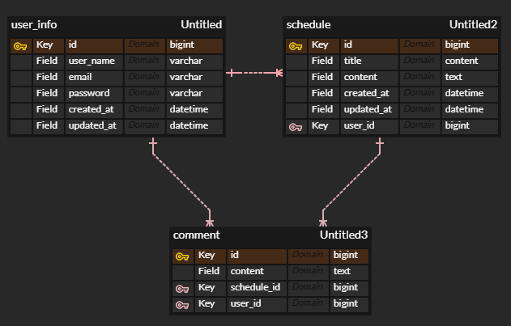

## Schedule

Spring 5기 CH3 일정 관리 앱 만들기

---
### 📜 개요

JPA를 활용해 DB 관리와 Cookie/Session을 활용한 인증/인가를 적용한 일정 관리 프로젝트 
→ 기본 CRUD에 대한 구조 이해도를 기반으로 기본적인 보안 개념과 인증 매커니즘 이해

---
### 🛠️ 개발 프로세스

#### 개발 환경
-    

#### 요구사항
- 공통 조건
    - 모든 테이블은 고유식별자(ID)를 가짐
    - 3 Layer Architecture에 따른 각 계층의 목적에 맞는 설계
    - CRUD 필수 기능은 DB 연결 및 JPA 사용
    - 인증/인가는 Cookie/Session 활용
    - JPA 연관관계는 단방향 (필요시만 양방향)

#### 설계

- API 명세서

  
Schedule

| **기능**    | **Method** | **URL**             | **request**        | **response**        | **상태 코드**     |
|-----------|------------|---------------------|--------------------|---------------------|---------------|
| **일정 생성** | `POST`     | `/schedules`        | ScheduleRequestDto | -                   | `201 Created` |
| **일정 조회** | `GET`      | `/schedules`        | -                  | ScheduleResponseDto | `200 OK`      |
| **일정 수정** | `PUT`      | `/schedules/{id}` | ScheduleRequestDto | ScheduleResponseDto | `200 OK`      |
| **일정 삭제** | `DELETE`   | `/schedules/{id}`   | -                  | -                   | `200 OK`      |
    

  
User

| **기능**       | **Method** | **URL**             | **request**              | **response**        | **상태 코드**     |
|--------------|------------|---------------------|--------------------------|---------------------|---------------|
| **회원 가입**    | `POST`     | `/users`            | SignUpRequestDto         | UserInfoResponseDto | `201 Created` |
| **회원 조회**    | `GET`      | `/users`        | -                        | UserInfoResponseDto | `200 OK`      |
| **회원 정보 수정** | `PUT`      | `/users/{id}` | UpdateUserInfoRequestDto | UserInfoResponseDto | `200 OK`      |
| **회원 삭제**    | `DELETE`   | `/users/{id}`   | -                        | -                   | `200 OK`      |

  
Comment

| **기능**       | **Method** | **URL**       | **request**       | **response**       | **상태 코드**     |
|--------------|------------|---------------|-------------------|--------------------|---------------|
| **댓글 생성**    | `POST`     | `/comments`   | CommentRequestDto | CommentResponseDto | `201 Created` |
| **회원 조회**    | `GET`      | `/comments`   | -                 | CommentResponseDto | `200 OK`      |
| **회원 정보 수정** | `PUT`      | `/comments/{id}` | CommentRequestDto | CommentResponseDto | `200 OK`      |
| **회원 삭제**    | `DELETE`   | `/comments/{id}` | -                 | -                  | `200 OK`      |

  
Authentication

| **기능**    | **Method** | **URL**        | **request**     | **response** | **상태 코드**     |
|-----------|------------|----------------|-----------------|--------------|---------------|
| **로그인**   | `POST`     | `/auth/login`  | LoginRequestDto | -            | `200 OK`      |
| **로그인**   | `POST`     | `/auth/logout` | -               | -            | `200 OK`      |

- ERD  

  

---
### 🌱 필수기능

- [x] lv0. API 명세 및 ERD 작성
- [x] lv1. 일정 CRUD
    - 일정 필드 : 작성자, 할일 제목, 할일 내용, 작성일, 수정일
    - 작성일, 수정일 필드은 JPA Auditing 활용
- [x] lv2. 유저 CRUD
    - 유저 필드 : 유저명, 이메일, 비밀번호, 작성일, 수정일
    - 일정의 작성자는 유저 고유 식별자 필드를 가짐
- [x] lv3. 회원가입
- [x] lv4. 로그인(인증)
  - Cookie/Session 활용
  - @Configuration 활용해 필터 등록 -> 인증 처리
  - 이메일, 비밀번호로 로그인 기능 구현
  - 예외처리 : 로그인 정보가 일치하지 않을 경우 401 코드 반환

### 🌴 도전기능

- [x] lv5. 다양한 예외처리 적용
  - Validation 사용 - 유효성 검사
  - 프로젝트를 분석해 예외사항 직접 지정(@Pattern 등 사용 가능)
- [x] lv6. 비밀번호 암호화
  - PasswordEncoder 사용
- [x] lv7. 댓글 CRUD
  - 댓글 필드 : 댓글 내용, 작성일, 수정일, 유저 고유 식별자, 일정 고유 식별자
  - 일정과 연관관계 매핑
- [x] lv8. 일정 페이징 조회
  - Spring Data JPA의 Pageable과 Page 인터페이스를 활용해 페이지네이션 구현
  - 페이지 번호, 페이지 크기를 쿼리 파라미터로 전달
  - 할일 제목, 할일 내용, 댓글 개수, 일정 작성일, 일정 수정일, 일정 작성 유저명 필드 조회(수정일 기준 내림차순)
  - default 페이지 크기는 10

---
### 트러블 슈팅

- [TIL 링크](https://heni0717.tistory.com/)

---